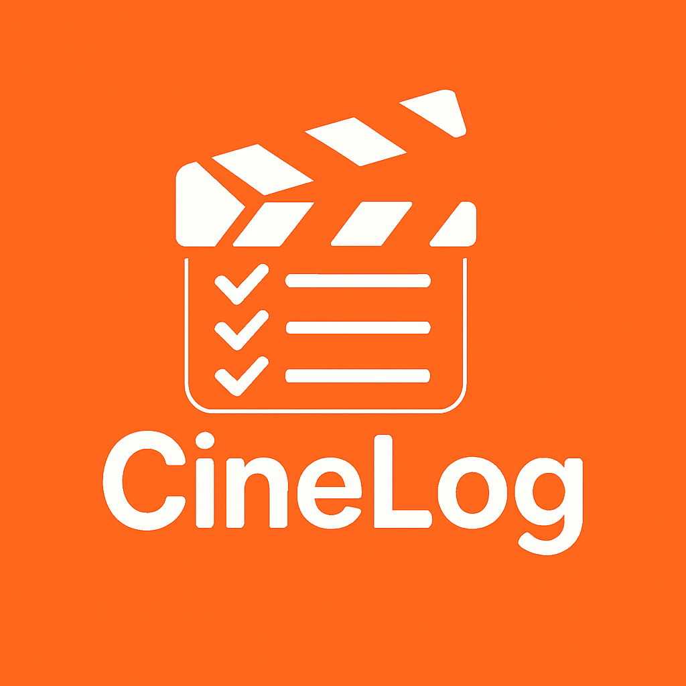

# 🎬 CineLog

A beautiful, personal movie and TV series watchlist app built with Flutter. Keep track of what you want to watch, what you've watched, and discover your favorites with an elegant dark-themed interface.



## ✨ Features

### 🎭 Core Functionality
- **Personal Watchlist**: Add movies and TV series to your personal watchlist
- **Watch Status Tracking**: Mark items as watched/unwatched with visual indicators
- **Favorites System**: Heart your favorite movies and TV shows
- **Smart Categories**: Browse content by genre (Action, Comedy, Romance, Drama, Thriller, Sci-Fi)
- **Search & Filter**: Quickly find content with powerful search functionality
- **Detailed Information**: View comprehensive details including ratings, descriptions, and posters

### 🎨 User Experience
- **Beautiful Dark Theme**: Elegant dark UI with orange accent colors (#FF6B35)
- **Responsive Design**: Optimized for phones, tablets, and different orientations
- **Smooth Animations**: Professional splash screen with fade and slide animations
- **Intuitive Navigation**: Bottom navigation with dedicated tabs for Movies, TV Series, Watchlist, and Favorites
- **Visual Indicators**: Clear watched/unwatched and favorite status indicators

### ♿ Accessibility
- **Screen Reader Support**: Full compatibility with screen readers
- **High Contrast Mode**: Support for high contrast accessibility settings
- **Large Text Scaling**: Supports up to 2x text scaling
- **WCAG Compliance**: Meets accessibility guidelines for inclusive design

### 📱 Technical Features
- **Offline Storage**: Local data persistence using Hive database
- **Cross-Platform**: Runs on Android, iOS, and Web
- **Performance Optimized**: Smooth 60 FPS animations and efficient memory usage
- **Comprehensive Testing**: Unit, widget, integration, and accessibility tests

## 📸 Screenshots

### Home Screen
- Clean, organized layout with floating CineLog logo
- Separate sections for watched/unwatched content
- Two-row horizontal scrolling lists for optimal space usage

### Navigation Tabs
- **Movies**: Browse and manage your movie collection
- **TV Series**: Dedicated section for television shows
- **Watchlist**: View all your saved content in one place
- **Favorites**: Quick access to your favorite movies and shows

### Add Content
- Easy-to-use form for adding new movies and TV series
- Support for posters, ratings, descriptions, and metadata

## 🚀 Getting Started

### Prerequisites
- Flutter SDK (>=3.0.0)
- Dart SDK (>=3.0.0)

### Installation

1. **Clone the repository**
   ```bash
   git clone https://github.com/yourusername/cinelog.git
   cd cinelog
   ```

2. **Install dependencies**
   ```bash
   flutter pub get
   ```

3. **Generate Hive adapters**
   ```bash
   flutter packages pub run build_runner build
   ```

4. **Run the app**
   ```bash
   flutter run
   ```

### Building for Production

**Android APK:**
```bash
flutter build apk --release
```

**iOS:**
```bash
flutter build ios --release
```

**Web:**
```bash
flutter build web --release
```

## 🏗️ Architecture

### Project Structure
```
lib/
├── main.dart                 # App entry point
├── models/                   # Data models
│   ├── watchlist_item.dart   # Main data model with Hive annotations
│   └── splash_config.dart    # Splash screen configuration
├── screens/                  # UI screens
│   ├── splash_screen.dart    # Animated splash screen
│   ├── home_screen.dart      # Main navigation hub
│   ├── add_item_screen.dart  # Add new content
│   ├── movie_details_screen.dart # Detailed item view
│   └── category_list_screen.dart # Category browsing
├── services/                 # Business logic
│   └── storage_service.dart  # Hive database operations
└── widgets/                  # Reusable UI components
    ├── cinelog_logo.dart     # Custom logo widget
    └── watchlist_tile.dart   # List item component
```

### Key Technologies
- **Flutter**: Cross-platform UI framework
- **Hive**: Fast, lightweight NoSQL database
- **Material 3**: Modern Material Design components
- **Custom Animations**: Smooth transitions and micro-interactions

## 🎨 Design System

### Color Palette
- **Primary**: `#FF6B35` (Orange) - Accent color for buttons and highlights
- **Background**: `#1A1D29` (Dark Blue) - Main background
- **Surface**: `#2A2D3A` (Lighter Dark) - Cards and input fields
- **Text**: `#FFFFFF` (White) - Primary text
- **Secondary Text**: `#B0B3B8` (Light Gray) - Secondary information

### Typography
- **Font Family**: Monospace for a modern, technical aesthetic
- **Responsive Sizing**: Scales appropriately across different screen sizes
- **Accessibility**: Supports large text scaling up to 2x

### Components
- **Rounded Corners**: 16px for cards, 25px for buttons and inputs
- **Shadows**: Subtle elevation for depth
- **Icons**: Material Design icons with consistent sizing
- **Spacing**: 8px grid system for consistent layouts

## 🧪 Testing

The project includes comprehensive testing coverage:

### Test Types
- **Unit Tests**: Core business logic and data models
- **Widget Tests**: Individual UI component testing
- **Integration Tests**: End-to-end user flows
- **Accessibility Tests**: Screen reader and WCAG compliance
- **Performance Tests**: Animation smoothness and memory usage

### Running Tests

**All tests:**
```bash
flutter test
```

**Integration tests:**
```bash
flutter test test/integration/
```

**Specific test file:**
```bash
flutter test test/splash_screen_test.dart
```

### Test Coverage
- **Splash Screen**: 100% coverage including animations and error handling
- **Storage Service**: Complete CRUD operations testing
- **UI Components**: Widget rendering and interaction testing
- **Accessibility**: Screen reader compatibility and guidelines compliance

## 📦 Dependencies

### Core Dependencies
- **flutter**: Cross-platform UI framework
- **hive**: `^2.2.3` - Fast, lightweight database
- **hive_flutter**: `^1.1.0` - Flutter integration for Hive
- **google_fonts**: `^6.2.1` - Custom font support
- **http**: `^1.1.0` - HTTP client for API calls

### Development Dependencies
- **flutter_test**: Testing framework
- **integration_test**: End-to-end testing
- **flutter_lints**: Code quality and style
- **hive_generator**: `^2.0.1` - Code generation for Hive
- **build_runner**: `^2.4.7` - Build system

## 🔧 Configuration

### Splash Screen
The app features a configurable splash screen with multiple presets:

```dart
// Production (default): 3-second experience
SplashConfig.production()

// Debug: Fast 0.5-second experience
SplashConfig.debug()

// Fast: Balanced 1.5-second experience
SplashConfig.fast()
```

### Storage
Local storage is handled by Hive with automatic initialization:
- Data persists between app sessions
- Efficient querying and filtering
- Automatic backup and recovery

## 🚀 Performance

### Optimization Features
- **Lazy Loading**: Content loaded on demand
- **Efficient Animations**: GPU-accelerated transitions
- **Memory Management**: Proper resource cleanup
- **Responsive Images**: Optimized poster loading with fallbacks

### Benchmarks
- **Startup Time**: <3 seconds including splash screen
- **Animation Performance**: 60 FPS target maintained
- **Memory Usage**: <50MB typical usage
- **Storage Efficiency**: Minimal database footprint

## ♿ Accessibility

CineLog is built with accessibility as a core principle:

### Features
- **Screen Reader Support**: Full VoiceOver/TalkBack compatibility
- **High Contrast**: Automatic adaptation to system settings
- **Large Text**: Supports accessibility text scaling
- **Keyboard Navigation**: Full keyboard accessibility
- **Focus Management**: Logical tab order and focus indicators

### Compliance
- **WCAG 2.1 AA**: Meets accessibility guidelines
- **Platform Standards**: Follows iOS and Android accessibility best practices
- **Testing**: Regular testing with actual assistive technologies

## 🤝 Contributing

We welcome contributions! Please follow these steps:

1. **Fork the repository**
2. **Create a feature branch**: `git checkout -b feature/amazing-feature`
3. **Make your changes** with proper testing
4. **Run tests**: `flutter test`
5. **Commit changes**: `git commit -m 'Add amazing feature'`
6. **Push to branch**: `git push origin feature/amazing-feature`
7. **Open a Pull Request**

### Development Guidelines
- Follow Flutter/Dart style guidelines
- Add tests for new features
- Update documentation as needed
- Ensure accessibility compliance
- Test on multiple screen sizes

## 📄 License

This project is licensed under the MIT License - see the [LICENSE](LICENSE) file for details.

## 🙏 Acknowledgments

- **Flutter Team**: For the amazing cross-platform framework
- **Hive Team**: For the efficient local database solution
- **Material Design**: For the beautiful design system
- **Community**: For feedback and contributions

## 📞 Support

If you encounter any issues or have questions:

1. **Check the Issues**: Look for existing solutions
2. **Create an Issue**: Describe your problem with details
3. **Discussions**: Join community discussions for help

## 🔮 Future Enhancements

### Planned Features
- **Cloud Sync**: Backup watchlist to cloud storage
- **Social Features**: Share recommendations with friends
- **Advanced Search**: Filter by year, rating, genre combinations
- **Statistics**: View watching habits and statistics
- **Themes**: Additional color themes and customization
- **Import/Export**: Backup and restore functionality
- **API Integration**: Fetch movie data from external APIs

### Technical Improvements
- **Performance**: Further optimization for large datasets
- **Offline Mode**: Enhanced offline capabilities
- **Animations**: More sophisticated micro-interactions
- **Accessibility**: Additional accessibility features

---

**Made with ❤️ using Flutter**

*CineLog - Your personal cinema companion*